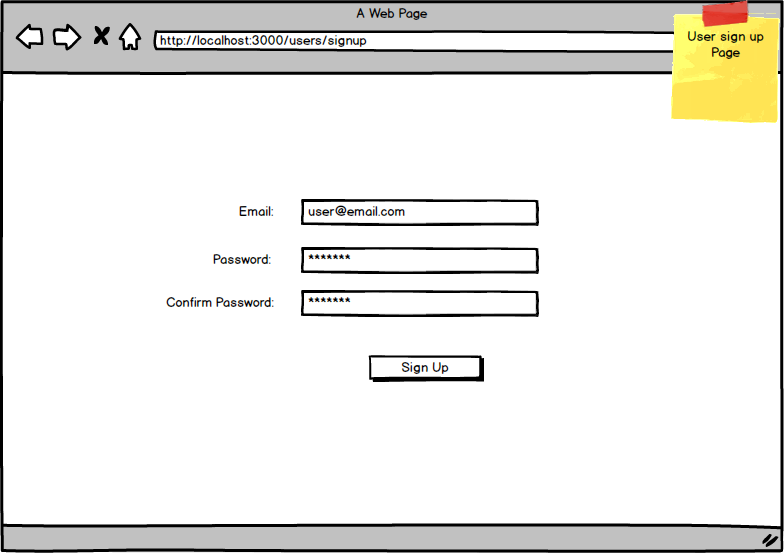
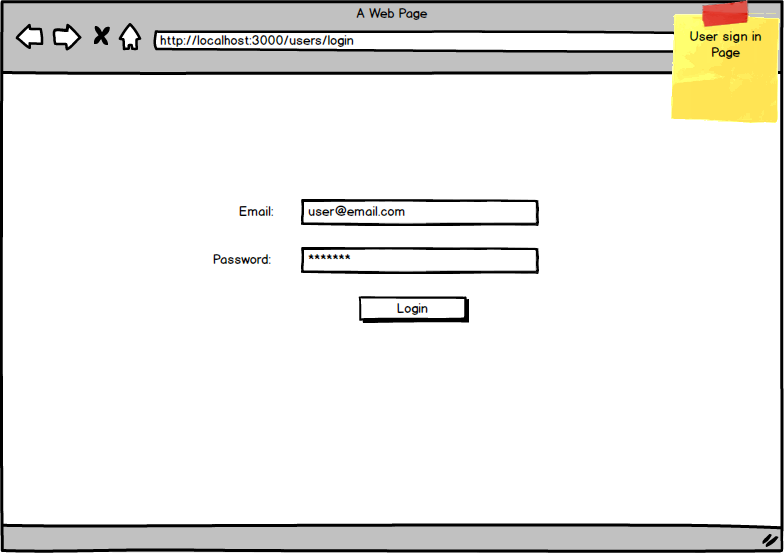
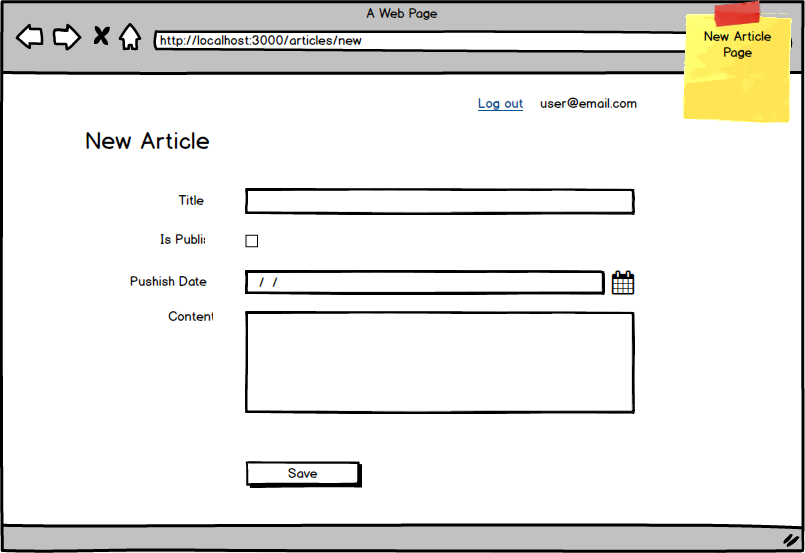
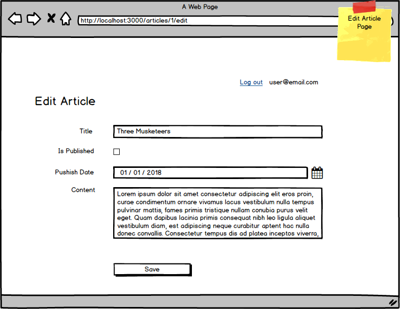
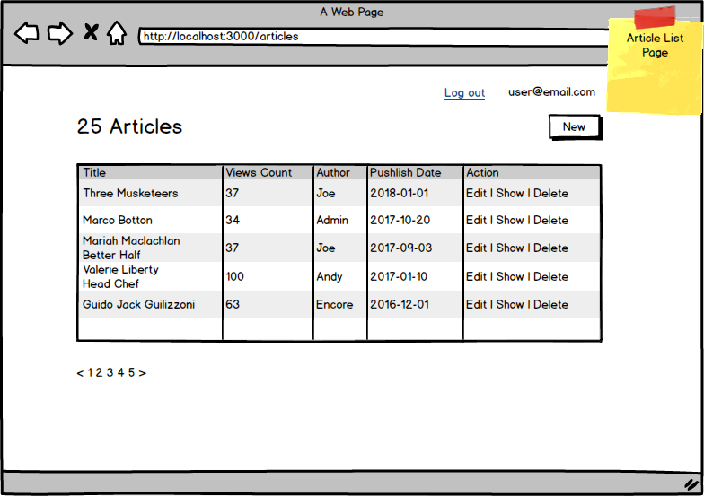
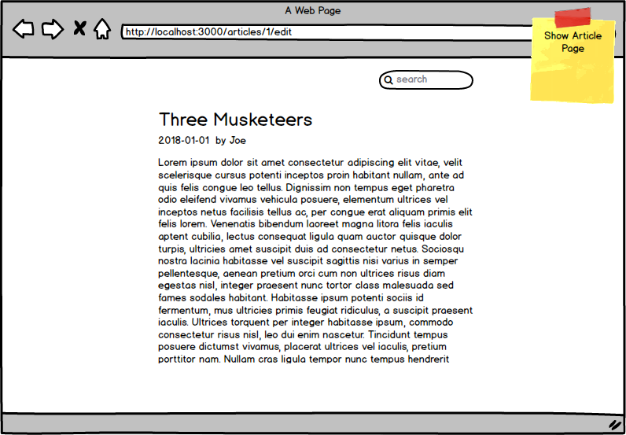
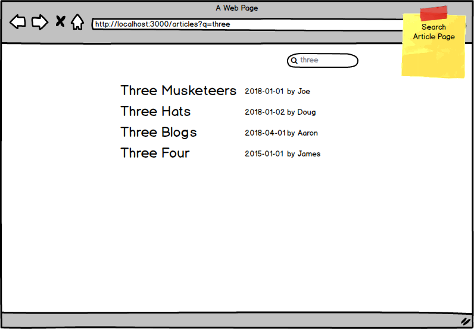

## Rails application for Ekohe in ShangHai. June 2021
Application was well completed however interviewer was not satisfied with my verbal responses.

## Opinion of the Ekohe interview
Interview was very bland, only consisting of textbook questions. Interviewer (Lead engineer) was not enthusiastic of company. HR replies only the last question asked in email.

-------------------------------------------
# Blog

Please implement a basic Blog with at least the following pages:

1. Signup Page
1. Login Page
1. New Article Page
1. Edit Article Page
1. Article Lists View
1. Show Article Page
1. Search Article Page

You're free to add in more features and improve the UX/UI as you like. Below are mockups for the individual pages.

#### Signup Page

#### Login Page

#### New Article Page

#### Edit Article Page

#### Article List Page

#### Show Article Page

#### Search Article Page

The most basic requirements:

1. manage your code by git.
1. write a document to explain what do you do, what extras you add, what difficulties you met and how you resolved it, etc.

If you have any question, please let us know.
